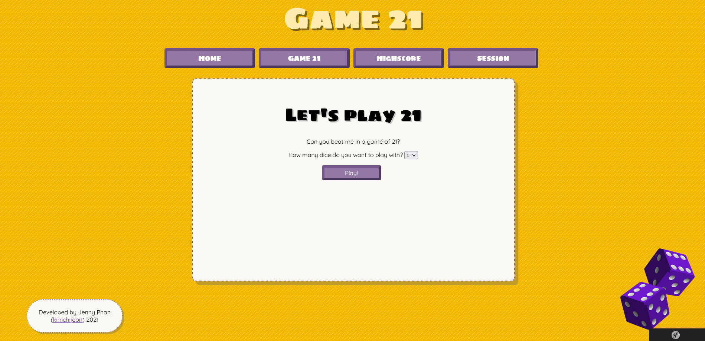

[](https://travis-ci.com/kimchijeon/mvc_project)

[](https://scrutinizer-ci.com/g/kimchijeon/mvc_project/?branch=main)
[](https://scrutinizer-ci.com/g/kimchijeon/mvc_project/?branch=main)
[](https://scrutinizer-ci.com/g/kimchijeon/mvc_project/build-status/main)

# MVC Kmom10 Project


This application is a project examination for course **Objectoriented Web Technologies** a.k.a. *mvc* at Bleking Tekniska Högskola, Spring 2021 made by Jenny Phan.

## Game Instructions
This application is called **Game 21**. 

It's a dice game where you throw dice to get as close to the number 21 as possible. In this application you play against a bot. 

If the bot gets closer to 21 than you or if you get the same number, **the bot wins**. <br>
If you get 21 or if the bot gets more than 21, **you win**.

### Start of the Game
At the start of the game you choose whether you want to play with 1 or 2 dice. Then you keep rolling until you are satisfied with your number.

### Betting
Before the bot plays you get to place a bet. You start with **10** coins, while the bot starts with **100** coins. If you think you will win the round, place a high bet to earn as much as possible. *Note: highest bet is 50% of your coins.* 

Will you be able to win all the bot's coins?

### End of Round
After the bot plays you will see the round results as well as a scoreboard and some statistics about the round you just played. The scoreboard keeps track of how many rounds you've played so far, and how many wins you and the bot have.

**Keep playing more rounds to collect more wins and coins!**

### Highscore
When you feel satisfied with your game, you can save your highscore by entering a username.

You can also check out the highscore at any time. Click on your username to see complete stats for every highscore you've saved.

## Installation
[Clone the repo](https://github.com/kimchijeon/mvc_project.git) or [download](https://github.com/kimchijeon/mvc_project/archive/refs/heads/main.zip) a ZIP of the code from GitHub.

You can also use GitHub CLI:
```
gh repo clone kimchijeon/mvc_project
```

To install the app:
```
make install
```

To access the app use the `public` directory.

### Set up highscore database
To create the highscore database and be able to save your highscores:
```
composer exec-mig
composer new-mig
composer exec-mig
```
or
```
php bin/console doctrine:migrations:migrate
php bin/console make:migration
php bin/console doctrine:migrations:migrate
```
## Have fun!